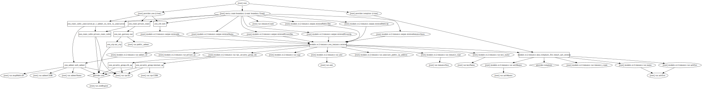

# AWS - Web demo



``Version 1.0.0``   

### Requirements   
`Terraform >= 0.11.7` 

### Description
Simple terraform code for demo purpouse, which will create web instance with apache2 and pre installed salt-minions for futher managing.  
Instances are by defualt in private subnet and internet acces is via NAT Gateway.  
Access to web is via internet facing AWS ELB.

### Structure

```
aws-web-demo-tf
    scripts
      |— installSaltMinion.sh.tpl
    modules
      |— ec2minion
           |— variables.tf
           |— main.tf
           |— outputs.tf
    |— main.tf
    |— network.tf
    |— provider.tf
    |— outputs.tf
    |— variables.tf
```

### Usage

1. Modify `terraform.tfvars` as needed

```golang
awsRegion = "eu-west-1"

// Network

vpcID = "vpc-b293b6d7"

vpcCIDR  = "172.31.0.0/16"

subnetName = "web_subnet"

subnetCIDR = "172.31.16.0/20"

public_subnet = "subnet-c472f5a0"


// ECS2

instanceCount  = "3"

ami = "ami-0ab63a0c3eg9f5183"

keyName = "demo-salt-minions"

instanceSize = "t2.micro"

// Saltstack 

saltEnv = "demo"

saltMaster  = "172.31.1.3"


```

2. Export environment variables for AWS account

```bash
export AWS_ACCESS_KEY_ID="XXXXXXXXXXX0000000"
export AWS_SECRET_ACCESS_KEY="XXX/XXX0000XXXXX00000/000000"
export AWS_DEFAULT_REGION="eu-west-1"
```

3. Initialize terraform modules

```
terraform init
```

4. Verify what will be added or changed

```
terraform plan
```

5. Apply terraform

```
terraform apply
```

### Resources created:
```
Terraform will perform the following actions:

  - aws_eip.nat_eip

  - aws_elb.web

  - aws_nat_gateway.nat

  - aws_route.private_route

  - aws_route_table.private_route_table

  - aws_route_table_association.pr_1_subnet_eu_west_1a_association

  - aws_security_group.elb_sg

  - aws_security_group.internal_sg

  - aws_subnet.web_subnet

  - module.ec2-instance.aws_instance.minion[0]

  - module.ec2-instance.aws_instance.minion[1]
```
### Maintainer
`Simian Labs` - (https://github.com/simianlabs)  
http://simianlabs.io || sl@simianlabs.io